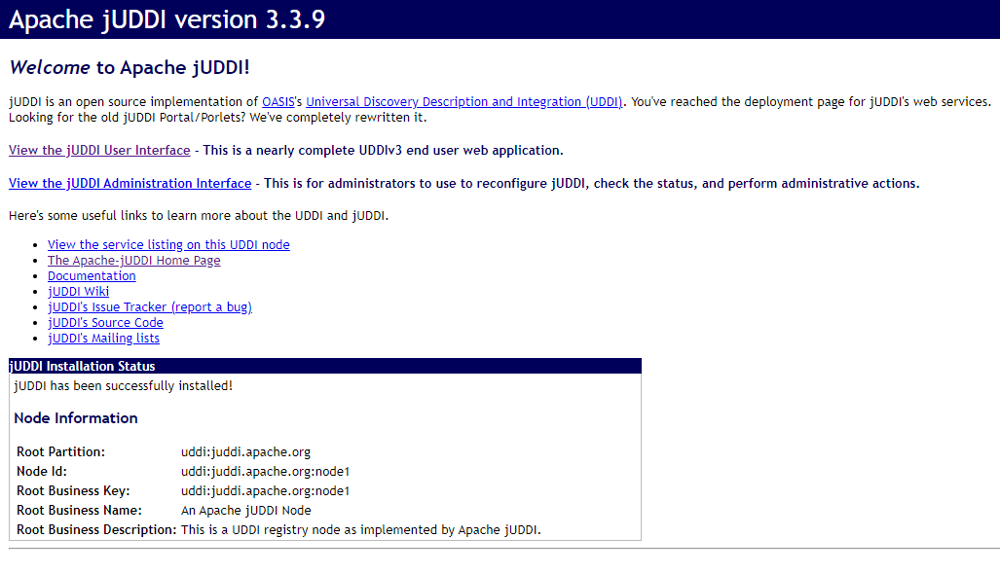
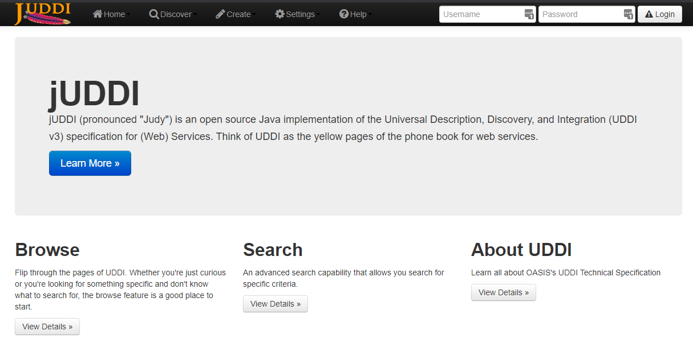
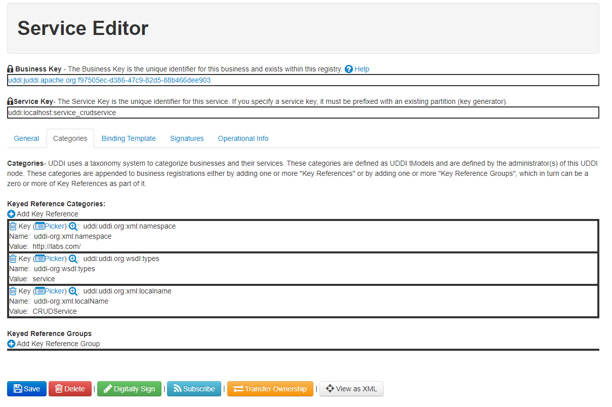
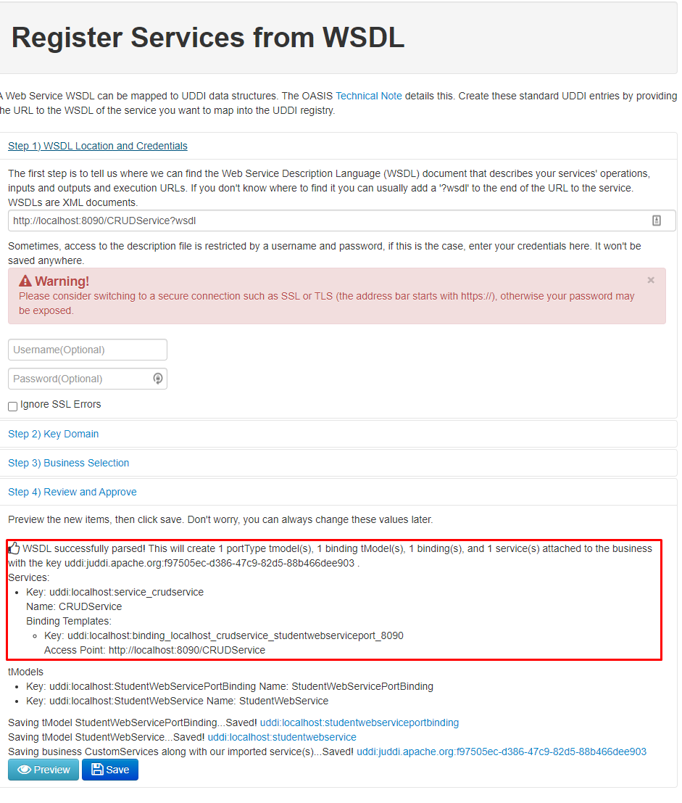
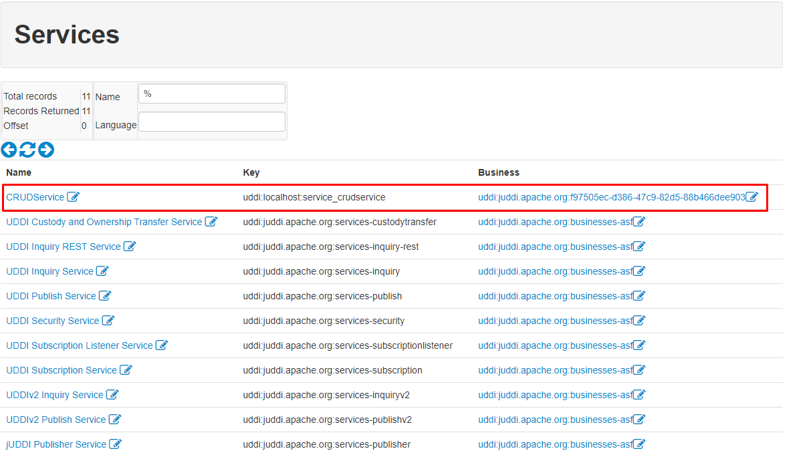
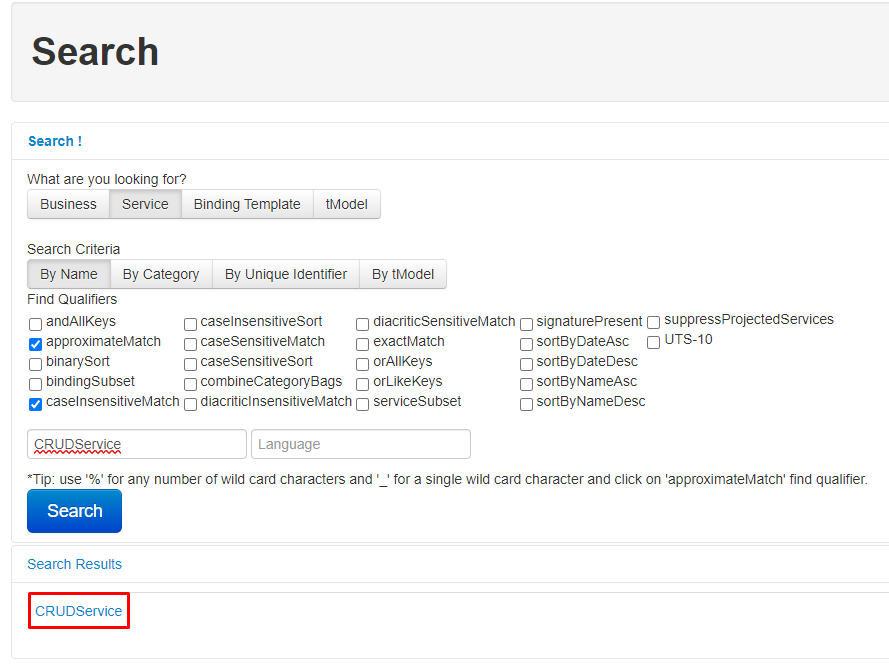

**Лабораторная работа 7. Регистрация и поиск сервиса в реестре jUDDI**

# Регистрация и поиск сервиса в реестре jUDDI

## Задание

Разработать приложение, осуществляющее регистрацию сервиса в реестре jUDDI, а также поиск сервиса в реестре и обращение к нему. 

Необходимо реализовать консольное приложение, которое обрабатывает 2 команды:

* Первая - регистрация сервиса в реестре.
* Вторая - поиск сервиса и обращение к нему.


## Ход работы

В данной работе необходимо скачать Apache jUDDI (реестр сервисов) по ссылке:

http://archive.apache.org/dist/juddi/juddi/3.2.0/

Таким образом мы получим последнюю версию jUDDI 3.3.9. Для Windows необходимо скачать zip-архив и распаковать его. Далее переходим в директории распакованного архива в каталог `juddi-tomcat-3.3.9/bin` и запускаем через файл `startup.bat`. Как правило, стоит запускать НЕ от имени администратора. При необходимости можно переименовать файл startup.bat или создать ярлык, а затем добавить его в переменную Path и производить запуск из консоли, например, по ключевому слову juddi. Необходимо иметь свободный порт 8080. Далее переходим по необходимому адресу:

* Для просмотра информации и администрирования - http://localhost:8080/juddiv3
* Для доступа к GUI - http://localhost:8080/juddi-gui

> Также имеется доступ по SSL через порт 8443 и сервер занимает IP 0.0.0.0, то есть должен быть доступен из всех "открытых" сетей. Но для доступа по SSL необходимо будет установить соответствующий сертификат.







В директории `\juddi-tomcat-3.3.9\conf` можно просмотреть пользователя по умолчанию в строках:

```xml
...
<role rolename="uddiadmin"/>
<user username="uddiadmin" password="da_password1" roles="uddiadmin,tomcat,manager" />
...
```

Следует их изменить следующим образом:

```xml
<tomcat-users>
    <role rolename="tomcat"/>
    <role rolename="manager"/>
    <role rolename="uddiadmin"/>
    <user username="uddiadmin" password="da_password1" roles="uddiadmin,tomcat,manager" />
</tomcat-users>
```

Далее перезапускаем jUDDI и используем указанные имя пользователя и пароль для входа в панель администрирования и gui.

 Попробуем зарегистрировать сервис через графический интерфейс в браузере, для чего изначально создаем во вкладке Create -> Business новый "бизнес" и далее во вкладке Create ->Register Services from WSDL создаем новый сервис, но для регистрации изначально его запустим - выбираем сервис из лабораторной работы 3, изменяем порт, например, на 8090, т. к. tomcat использует порт 8080 по умолчанию, и запускаем сервис. Далее производим его регистрацию. После успешной регистрации мы можем его найти и просмотреть через Discover -> Search.





Соответственно регистрируем сервис, который запустили на порту 8090 по адресу:

```http
http://localhost:8080/CRUDService?wsdl
```




После чего, мы можем просмотреть наличие сервиса при помощи поиска.



Далее приступаем к программной реализации клиента, причем изначально попытаем написать часть для поиска сервиса и обращения к нему. После этого приступим к реализации части с регистрацией сервиса в реестре.

В pom.xml добавляем зависимости:

```xml
	<dependencies>
		<dependency>
			<groupId>org.apache.juddi</groupId>
			<artifactId>uddi-ws</artifactId>
			<version>3.2.0</version>
		</dependency>
		<dependency>
			<groupId>org.apache.juddi</groupId>
			<artifactId>juddi-client</artifactId>
			<version>3.2.0</version>
		</dependency>
	</dependencies>
```

Для поиска сервиса будем следовать представленному в методическом пособии примеру "simple-browse" из каталога examples jUDDI. Создадим для поиска сервиса класс ServiceSearch, в котором объявим метод searchServiceByName, который будет возвращать указатель на сервис, а принимать в качестве аргумента имя сервиса для поиска.

Основные операции по получению токена будем производить из основного класса JUDDIApp, а затем их передавать в метод класса ServiceSearch в качестве параметров, причем будем передавать данные доступа inquiry и token, а также название сервиса, который необходимо найти. Для удобства и возможности последующего расширения функционала будем при этом создавать новый экземпляр класса ServiceSearch и вызывать метод searchAndGetService, т.е. метод будет не статическим, т. к. по итогу работы мы будем хранить состояние с полученным ключом и другими необходимыми данными для данного сервиса. Информацию мы можем выводить в также консоль, с вопросом о необходимости обращения к сервису.  В изначальной реализации мы будем получать список бизнесов в JUDDI и производить поиск сервисов их перебором и сравнением с именем сервиса в запросе, что и предполагает реализация клиента для поиска сервиса. С другой стороны, возможно использовать поиск JUDDI через api, что относительно будет легче. 

Для регистрации сервиса по аналогии с примером simple-publish-portable реализуем метод registerNewService(), который поместим в класс JUDDIApp. Данный метод будет получать токен, наименование бизнеса, который необходимо зарегистрировать изначально для дальнейшей регистрации сервиса, а также наименование сервиса и ссылку для получения WSDL. 

И последним шагом потребуется реализовать обращение к сервису, который мы получаем через поиск в консольном клиенте, а также возможность получения данных для поиска и регистрации сервисов через консоль. В данном случае нам необходимо результатом работы поиска сервиса получать ссылку на данный сервис, а затем при помощи данной ссылки и ранее разработанного клиента можно будет производить обращения непосредственно к сервису. Если же при поиске возвращается null, то значит, что сервис не был найден в реестре jUDDI и к нему нет возможности обратиться. 

 Необходимо переписать поиск сервиса через bindingTemplates, чтобы в результате выдавать accessPoint, т. е. URL для найденного сервиса.

В итоге, преобразуем класс ServiceSearch следующим образом:

```java

public class ServiceSearch {

    public String getAccessServicePoint(
            UDDIInquiryPortType inquiry,
            String token,
            String serviceName) {
        try {
            return searchService(GetBusinessList(inquiry, token).getBusinessInfos(), inquiry, token, serviceName);
        } catch (Exception ex) {
            Logger.getLogger(JUDDIApp.class.getName()).log(Level.SEVERE, null, ex);
            ex.printStackTrace();
        }
        return null;
    }

    /**
     * Find all of the registered businesses. This list may be filtered
     * based on access control rules
     */
    private BusinessList GetBusinessList(
            UDDIInquiryPortType inquiry,
            String token)
            throws Exception {
        FindBusiness fb = new FindBusiness();
        fb.setAuthInfo(token);
        org.uddi.api_v3.FindQualifiers fq = new org.uddi.api_v3.FindQualifiers();
        fq.getFindQualifier().add(UDDIConstants.APPROXIMATE_MATCH);
        fb.setFindQualifiers(fq);
        Name searchName = new Name();
        searchName.setValue(UDDIConstants.WILDCARD);
        fb.getName().add(searchName);

        return inquiry.findBusiness(fb);
    }

    private String searchService(
            BusinessInfos businessInfos,
            UDDIInquiryPortType inquiry,
            String token,
            String serviceName)
            throws Exception {

        for (int i = 0; i < businessInfos.getBusinessInfo().size(); i++) {
            GetServiceDetail gsd = new GetServiceDetail();
            // Перехватываем NullPointerException, чтобы не выводить в лог.
            // Данное исключение лишь показывает, что закончились сервисы и мы получили null
            try {
                for (int k = 0; k < businessInfos.getBusinessInfo().get(i).getServiceInfos().getServiceInfo().size(); k++) {
                    gsd.getServiceKey().add(businessInfos.getBusinessInfo().get(i).getServiceInfos().getServiceInfo().get(k).getServiceKey());
                }
                gsd.setAuthInfo(token);
                System.out.println("Fetching data for business " + businessInfos.getBusinessInfo().get(i).getBusinessKey());
                ServiceDetail serviceDetail = inquiry.getServiceDetail(gsd);
                for (int k = 0; k < serviceDetail.getBusinessService().size(); k++) {
                    BusinessService get = serviceDetail.getBusinessService().get(k);

                    if (ListToString(get.getName()).equals(serviceName)) {
                        return  getServiceAccessPoint(get.getBindingTemplates());
                    }
                }
            } catch (NullPointerException ex) {
                    System.out.println("That's it! We get a " + ex);
                    return null;
            }
        }
        return null;
    }

    /**
     * This function is useful for translating UDDI's somewhat complex data
     * format to something that is more useful.
     */
    private String getServiceAccessPoint(BindingTemplates bindingTemplates) {
        if (bindingTemplates == null) {
            return null;
        }
        String serviceAccessPoint = null;
        for (int i = 0; i < bindingTemplates.getBindingTemplate().size(); i++) {
            if (bindingTemplates.getBindingTemplate().get(i).getAccessPoint() != null) {
                if (bindingTemplates.getBindingTemplate().get(i).getAccessPoint().getUseType() != null) {
                    if (bindingTemplates.getBindingTemplate().get(i).getAccessPoint().getUseType().equalsIgnoreCase(AccessPointType.WSDL_DEPLOYMENT.toString())) {
                        serviceAccessPoint = bindingTemplates.getBindingTemplate().get(i).getAccessPoint().getValue();
                    }
                }
            }
        }
        return serviceAccessPoint;
    }

    private String ListToString(List<Name> name) {
        StringBuilder sb = new StringBuilder();
        for (Name value : name) {
            sb.append(value.getValue());
        }
        return sb.toString();
    }
}
```

Теперь мы попросту будем возвращать accessPoint в виде строки, например `http://localhost:8080/CRUDService?wsdl` и далее при его помощи обращаться к сервису.

Приведем также реализацию для регистрации нового сервиса (метод registerNewService в основном классе JUDDIApp):

```java
    private void registerNewService(
            String token,
            String businessName,
            String registeredServiceName,
            String registeredServiceURL) {
        // Creating the parent business entity that will contain our service.
        BusinessEntity myBusEntity = new BusinessEntity();
        Name myBusName = new Name();
        myBusName.setValue(businessName);
        myBusEntity.getName().add(myBusName);

        // Adding the business entity to the "save" structure, using our
        // publisher's authentication info and saving away.
        SaveBusiness sb = new SaveBusiness();
        sb.getBusinessEntity().add(myBusEntity);
        sb.setAuthInfo(token);

        try {
            BusinessDetail bd = publish.saveBusiness(sb);
            String myBusKey = bd.getBusinessEntity().get(0).getBusinessKey();
            System.out.println("myBusiness key:  " + myBusKey);

            // Creating a service to save.
            // Only adding the minimum data: the parent business key retrieved
            // from saving the business
            // above and a single name.
            BusinessService myService = new BusinessService();
            myService.setBusinessKey(myBusKey);
            Name myServName = new Name();
            myServName.setValue(registeredServiceName);
            myService.getName().add(myServName);

            // Add binding templates, etc...
            BindingTemplate myBindingTemplate = new BindingTemplate();
            AccessPoint accessPoint = new AccessPoint();
            accessPoint.setUseType(AccessPointType.WSDL_DEPLOYMENT.toString());
            accessPoint.setValue(registeredServiceURL);
            myBindingTemplate.setAccessPoint(accessPoint);
            BindingTemplates myBindingTemplates = new BindingTemplates();
            // optional but recommended step, this annotations our binding with all
            // the standard SOAP tModel instance infos
            myBindingTemplate = UDDIClient.addSOAPtModels(myBindingTemplate);
            myBindingTemplates.getBindingTemplate().add(myBindingTemplate);

            myService.setBindingTemplates(myBindingTemplates);

            // Adding the service to the "save" structure, using our publisher's
            // authentication info and saving away.
            SaveService ss = new SaveService();
            ss.getBusinessService().add(myService);
            ss.setAuthInfo(token);
            ServiceDetail sd = publish.saveService(ss);
            String myServKey = sd.getBusinessService().get(0).getServiceKey();
            System.out.println("myService key:  " + myServKey);

            // Now you have published a business and service via
            // the jUDDI API!
            System.out.println("New service successfully registered!");

        } catch (RemoteException ex) {
            Logger.getLogger(JUDDIApp.class.getName()).log(Level.SEVERE, null, ex);
            ex.printStackTrace();
        }
    }
```


Для обращения к сервису возьмем ранее разработанный код клиента (см. Лабораторная работа 3), со сгенерированным интерфейсом по WSDL-описанию. То есть для обращения к сервису, нам потребуется лишь передать accessPoint клиенту и вызвать необходимые методы.

Таким образом, просто скопируем пакет com.labs.client из лабораторной работы 3 и получаем класс WebServiceClient, в котором изменим реализацию, чтобы обращаться к клиенту из основного класса JUDDIApp и передавать соответствующий accessPoint. 

Для большего удобства перенесем методы класса ServiceSearch в основной класс JUDDIApp и будем обращаться к ним по создаваемому экземпляру класса JUDDIApp (без отдельного класса). Далее с полученным значением AccessPoint для сервиса необходимо вызывать методы клиента. В классе WebServiceClient мы изменим метод main на нестатический метод, который потребует создания объекта и будем передавать в качестве аргумента - полученный при поиске сервиса accessPoint. Метод не будет ничего возвращать, т. к. для консольного клиента необходимо выводить данные в консоль, соответственно. 

Далее обращаемся из основного класса JUDDIApp к методу serviceRequest в классе клиента WebServiceClient, причем изначально создаем новый экземпляр данного класса:

```java
WebServiceClient serviceClient = new WebServiceClient();
serviceClient.serviceRequest(accessPoint);
```

Далее реализуем ввод данных из консоли по аналогии с предыдущими лабораторными работами и при этом установим значения по умолчанию:

```java
    public static void main(String[] args) {

        // Get data from console in
        Scanner scanner = new Scanner(System.in);

        System.out.println("Please, input your jUDDI admin username (default: uddiadmin)?");
        String userName = scanner.nextLine();
        if (userName.trim().isEmpty()) {
            userName = "uddiadmin";
        }
        System.out.println("Please, input your jUDDI admin password (default: da_password1)?");
        String userPass = scanner.nextLine();
        if (userPass.trim().isEmpty()) {
            userPass = "da_password1";
        }

        // Create UDDIClient and proxy to config, add references to UDDI API
        JUDDIApp app = new JUDDIApp();
        // Get Auth token as String
        String token = app.getUDDIToken(userName, userPass);

        // Register new service (for jUDDI v.3.0 and higher)
        System.out.println("Do you want to register a new Business/Service? (y -> yes, other -> no)");
        String agree = scanner.nextLine();
        if (agree.equals("y")) {

            System.out.println("What jUDDI Business Name will we use (default: Custom Business)?");
            String businessName = scanner.nextLine();
            if (businessName.trim().isEmpty()) {
                businessName = "Custom Business";
            }

            System.out.println("What jUDDI Service Name will we use (default: CRUDService)?");
            String registeredServiceName = scanner.nextLine();
            if (businessName.trim().isEmpty()) {
                businessName = "CRUDService";
            }

            System.out.println("What jUDDI Service Access Point (default: http://localhost:8090/CRUDService?wsdl)?");
            String registeredServiceURL = scanner.nextLine();
            if (registeredServiceURL.trim().isEmpty()) {
                registeredServiceURL = "http://localhost:8090/CRUDService?wsdl";
            }
            app.registerNewService(token, businessName, registeredServiceName, registeredServiceURL);
        }

        System.out.println("Do you want to search and request some Service? (y -> yes, other -> no)");
        agree = scanner.nextLine();
        if (agree.equals("y")) {

            System.out.println("What jUDDI Service Name will we search (default: CRUDService)?");
            String searchServiceName = scanner.nextLine();
            if (searchServiceName.trim().isEmpty()) {
                searchServiceName = "CRUDService";
            }

            // Search service
            String accessPoint;
            try {
                accessPoint = app.searchService(app.GetBusinessList(inquiry, token).getBusinessInfos(), inquiry, token, searchServiceName);
                System.out.println("Do you want to request this service now? (y -> yes, other -> no)");
                agree = scanner.nextLine();
                if (agree.equals("y")) {
                    WebServiceClient serviceClient = new WebServiceClient();
                    serviceClient.serviceRequest(accessPoint);
                }
            } catch (Exception ex) {
                Logger.getLogger(JUDDIApp.class.getName()).log(Level.SEVERE, null, ex);
                ex.printStackTrace();
            }
        }

        try {
            security.discardAuthToken(new DiscardAuthToken(token));
        } catch (RemoteException ex) {
            Logger.getLogger(JUDDIApp.class.getName()).log(Level.SEVERE, null, ex);
        } finally {
            scanner.close();
        }

    }
```

